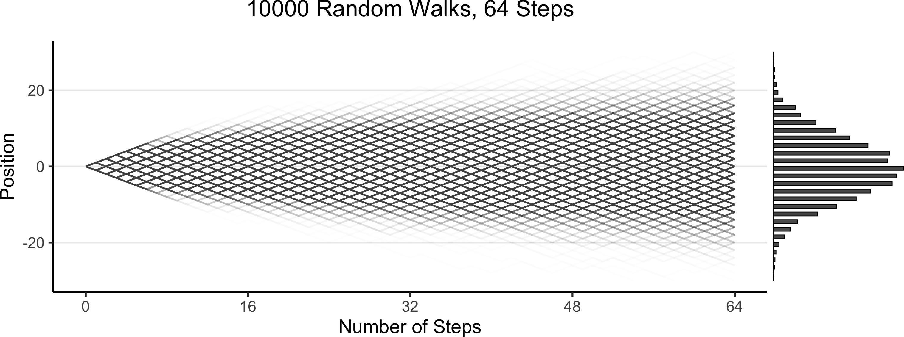

::: {.content-visible unless-format="revealjs"}

<center>
<a class="h2" href="./slides.html" target="_blank">Open slides in new window &rarr;</a>
</center>

:::

# Logistics / Table-Setting {.title-11 data-stack-name="Logistics"}



::: {.hidden}

```{r}
#| label: r-source-globals
source("../dsan-globals/_globals.r")
```

:::

* Midterm will be **27-Hour Take-Home Exam**
* A "Midterm" folder will magically appear on [guhub.io](https://guhub.io) at **9pm EDT** on **Wednesday, July 2** (immediately after lecture ends), due **11:59pm EDT** on **Thursday, July 3**
* $\leadsto$ Lecture recording will be a **video resource** for you, providing all the necessary background for midterm questions (like the intro-to-Afrobarometer last week!)

## From HWs to Midterm

* HWs: More focus on **social science** / more "in the weeds" (checking details, manipulating prior parameters, debugging, etc.)
* Midterm: More focus on **causality**, bc, in 2 hours I can test you on concepts and things like "What are the backdoor paths here? How would you close them?" more easily than on loading datasets, cleaning, fitting models, etc.

## Looking Forwards (Post-Midterm)

* More text analysis!
* Making the connection between **modeling** and **predicting**

# Bayesian Workflow {data-stack-name="HW2"}

*(There are a lot of words in HW2 that I haven't had the chance to explain yet!)*

* Prior
* Prior Predictive
* Posterior
* Posterior Predictive

## Modeling How Trees Become Forests {.smaller .crunch-title .title-11 .crunch-ul .crunch-li-6 .crunch-img .crunch-p .crunch-quarto-figure}

* Your **model**, if it's **generative** (which... nearly all in 5650 are), relates **observed** data $\mathbf{D}$ to a set of underlying **parameters** $\boldsymbol{\theta}$ that are hypothesized as "giving rise" to $\mathbf{D}$
* When you specify *how* exactly this "giving rise" works, you're specifying a **DGP**!
* **PGMs**: human-brain-friendly (bc *graphical*) **language for writing DGPs**; then move to PyAgrum $\rightarrow$ Stan $\rightarrow$ PyMC to "encode" PGMs (in `0100101`) so computer can...

```{=html}
<table>
<thead>
<tr>
  <th style="border: 0px; width: 50%" align="center"><span data-qmd="<i class='bi bi-1-circle'></i> **Super-charge your EDA/modeling**"></span></th>
  <th style="border: 0px; width: 50%" align="center"><span data-qmd="<i class='bi bi-2-circle'></i> **Estimate $\boldsymbol{\theta}$ from data**"></span></th>
</tr>
</thead>
<tbody>
<tr>
  <td align="center"><span data-qmd="$\leadsto$ **Prior** distributions"></span></td>
  <td align="center"><span data-qmd="$\leadsto$ **Posterior** distributions"></span></td>
</tr>
</tbody>
</table>
```

```{r}
#| label: walk-plot
#| fig-width: 16
#| fig-height: 6
#| crop: false
#| eval: false
library(tidyverse)
library(ggExtra)
gen_walk_plot <- function(walk_data, a=0.0075) {
  # print(end_df)
  grid_color <- rgb(0, 0, 0, 0.1)
  # And plot!
  walkplot <- ggplot() +
    geom_line(
      data = walk_data$long_df,
      aes(x = t, y = pos, group = pid),
      linewidth = g_linewidth,
      alpha = a,
      #color = cb_palette[2]
      #color = "#cf8f00"
      color = "black"
    ) +
    geom_point(
      data = walk_data$end_df,
      aes(x = t, y = endpos),
      alpha = 0
    ) +
    scale_x_continuous(
      breaks = seq(
        0,
        walk_data$num_steps,
        walk_data$num_steps / 4
      )
    ) +
    scale_y_continuous(
      breaks = seq(-20, 20, 10)
    ) +
    theme_dsan(base_size=24) +
    theme(
      legend.position = "none",
      # title = element_text(size = 16)
    ) +
    theme(
      panel.grid.major.y = element_line(
        color = grid_color,
        linewidth = 1,
        linetype = 1
      )
    ) +
    labs(
      title = paste0(
        walk_data$num_people, " Random Walks, ",
        walk_data$num_steps, " Steps"
      ),
      x = "Number of Steps",
      y = "Position"
    )
}
walk_data <- readRDS("assets/walk_data.rds")
# 16 steps
# wp1 <- gen_walkplot(500, 16, 0.05)
# ggMarginal(wp1, margins = "y", type = "histogram", yparams = list(binwidth = 1))
wp <- gen_walk_plot(walk_data) + ylim(-30,30)
ggMarginal(
  wp, margins = "y",
  type = "histogram",
  yparams = list(binwidth = 1)
)
```

{fig-align="center"}

## Prior "Stage" Distributions {.title-10 .smaller .crunch-title .crunch-ul .crunch-quarto-figure .crunch-p .crunch-li-8 .text-60}

* RVs $\boldsymbol\theta$ = params of your model, RVs $\mathbf{X}$ = data $\leadsto$ **Generative** model $\pedge{\boldsymbol\theta}{\mathbf{X}}$
* Enter **Prior World** (**Before** observing any data): Since we have **priors** over $\boldsymbol\theta$ $\leadsto$ we can **sample** values of $\boldsymbol\theta$, then **generate synthetic data** on the basis of these values

<!-- * Looking at this connection, we could **
*  you have (like, in a .csv), and $\ -->

:::: {.columns}
::: {.column width="50%"}

<center>

<i class='bi bi-1-circle'></i> **Prior Distribution:** $\Pr(\boldsymbol{\theta}^{❓})$

</center>

*What can I guess about values of my parameters from background knowledge of the world?* e.g.:

* Human heights can't be negative
* Data collected at a bar $\Rightarrow$ Age $\geq$ 18, $\Pr(\text{Age} = x)$ decreases as $x$ goes above 30

{fig-align="center" width="280"}

:::
::: {.column width="50%"}

<center>

<i class='bi bi-2-circle'></i> **Prior Predictive Distribution: ** $\Pr(\mathbf{X}^{❓} \mid \boldsymbol{\theta}^{❓})$

</center>

*What could the outcomes look like if I ran my guesses through the **DGP**?*

{width="75" style="float: right;"}

100 simulated heights, none are negative

1K sim bar-goers; 80% have this haircut $\rightarrow$

{fig-align="center" width="340" style="padding-top: 50px;"}

:::
::::

## Posterior "Stage" Distributions {.title-10 .smaller .crunch-title .crunch-ul .crunch-quarto-figure .crunch-p .crunch-li-8 .text-60 .inline-90}

* RVs $\boldsymbol\theta$ = params of your model, RVs $\mathbf{X}$ = data $\leadsto$ **Generative** model $\pedge{\boldsymbol\theta}{\mathbf{X}}$

:::: {.columns}
::: {.column width="50%"}

<center style="margin-top: 5px;">

<i class='bi bi-3-circle'></i> **Posterior Distribution:** $\Pr\left(\boldsymbol{\theta} \; \middle| \; \mathbf{X} = \ponode{\mathbf{X}}\right)$

</center>

*Now we **observe** data: $\pnode{\mathbf{X}} \leadsto \ponode{\mathbf{X}}$, which means we can use **Bayes' Rule** to infer distribution over $\boldsymbol{\theta}$: **what values are most likely to produce $\ponode{\mathbf{X}}$**?*

* 60% of observed bar-goers have that haircut $\Rightarrow$ $\boldsymbol{\theta}_{\text{post}} \approx \frac{0.6 + 0.8}{2} = 0.7$
* Coin = $\textsf{H}$ 4/5 times $\Rightarrow$ $\boldsymbol{\theta} = p = \frac{0.5 + 0.8}{2} = 0.65$
* Coin = $\textsf{H}$ 5/5 times $\Rightarrow$ $\boldsymbol{\theta} = p = \frac{0.5 + 1.0}{2} = 0.75$

{fig-align="center" width="350"}

:::
::: {.column width="50%"}

<center style="margin-top: 5px;">

<i class='bi bi-4-circle'></i> **Posterior Predictive Distribution:** $\Pr(\mathbf{X} \mid \boldsymbol{\theta})$

</center>

*Now that we've fit $\Pr(\boldsymbol{\theta})$ to data, can generate as much new data as we want, e.g. to evaluate **how well model predicts outcomes for test data***

](images/logistic-post-pc.webp){fig-align="center"}

:::
::::

## Why Do We Need "Subjective" Priors? {.smaller .title-12 .crunch-title .crunch-ul .crunch-quarto-figure}

* Under frequentism... (tldr) literally no method for dealing with shades of uncertainty
* Frequentist assumption: For a given coin, $\Pr(\textsf{Heads})$ is **not a Random Variable!** It's some number, like 0.5 or 0.8. It's the **asymptote** of $\frac{\#[\textsf{Heads}]}{\#[\textsf{Heads}] + \#[\textsf{Tails}]}$ as $n \rightarrow \infty$
* So, if we flip coin 1 time, and get $\textsf{Heads}$, **no basis for inferring** $\Pr(\textsf{Coin is Fair})$ vs. $\Pr(\textsf{Coin is Biased})$: Both are **undefined**. We've... "discovered" that $\Pr(\textsf{Heads}) = 1$
* By using **Bayesian inference**, we can bring **prior knowledge** into our studies, which we'll need to do **especially** for complex emergent systems: societies, economies, etc.!
* In fact, as a guy named **Laplace** discovered in the nineteenth century, frequentism = Bayesian inference with **"flat priors"**...

## Flat vs. Informative Priors {.smaller .title-10 .crunch-title .crunch-quarto-layout-panel .crunch-quarto-figure .crunch-img .crunch-p}

:::: {layout="[30,5,30,5,30]" layout-valign="center"}
::: {#flat-prior}

```{r}
#| label: flat-priors
#| fig-width: 5.5
#| fig-height: 5.5
library(tidyverse)
flat_df <- tibble(x=seq(0, 1, 0.1), y=0)
flat_df |> ggplot(aes(x=x, y=y)) +
  geom_line(
    color=cb_palette[1],
    linewidth=g_linewidth
  ) +
  ylim(0, 1) +
  labs(
    title="Flat Prior on Pr(Heads)",
    y="Density"
  ) +
  theme_dsan(base_size=28) +
  theme(title=element_text(size=20))
```

:::
::: {#flat-times}

$$
\otimes
$$

:::
::: {#flat-data}

```{r}
#| label: data-plot
#| fig-width: 5.5
#| fig-height: 5.5
library(tidyverse)
data_df <- tibble(x=1, y=1)
data_df |> ggplot(aes(x=x, y=y)) +
  geom_point(size=5) +
  geom_segment(
    x=1, y=0, yend=1, linewidth=g_linewidth
  ) +
  xlim(0, 1) +
  ylim(0, 1) +
  labs(
    title="Observed Data",
    y="Density"
  ) +
  theme_dsan(base_size=28) +
  theme(title=element_text(size=20))
```

:::
::: {#flat-eq}

$$
\leadsto
$$

:::
::: {#flat-post}

```{r}
#| label: flat-posterior
#| fig-width: 5.5
#| fig-height: 5.5
library(tidyverse)
library(latex2exp)
w_label <- TeX("Width = $1/n$")
h_label <- TeX("Height = $n$")
data_df <- tibble(x=1, y=1)
data_df |> ggplot(aes(x=x, y=y)) +
  geom_segment(
    x=1, y=0, yend=1, linewidth=g_linewidth,
    color=cb_palette[1], arrow=arrow()
  ) +
  geom_segment(
    x=0, y=0, xend=1, linewidth=g_linewidth,
    color=cb_palette[1]
  ) +
  xlim(0, 1) +
  ylim(0, 1) +
  labs(
    title="Posterior of Pr(Heads)",
    y = "Density"
  ) +
  theme_dsan(base_size=28) +
  theme(title=element_text(size=20)) +
  annotate(
    geom = "text", x = 0.5, y = 0.8, 
    label = w_label, hjust = 0, vjust = 1, size = 8
  ) +
  annotate(
    geom = "text", x = 0.5, y = 0.7, 
    label = h_label, hjust = 0, vjust = 1, size = 8
  )
```

:::
::::

:::: {layout="[30,5,30,5,30]" layout-valign="center"}
::: {#unif-prior}

```{r}
#| label: unif-priors
#| fig-width: 5.5
#| fig-height: 5.5
library(tidyverse)
unif_df <- tibble(x=seq(0, 1, 0.1), y=1)
unif_df |> ggplot(aes(x=x, y=y)) +
  geom_line(
    color="#e69f00", linewidth=g_linewidth
  ) +
  annotate('rect', xmin=0, xmax=1, ymin=0, ymax=1, fill='#e69f00', alpha=0.3) +
  xlim(0, 1) + ylim(0, 1) +
  labs(title="Uniform Prior on Pr(Heads)") +
  theme_dsan(base_size=28) +
  theme(title=element_text(size=20))
```

:::
::: {#unif-times}

$$
\otimes
$$

:::
::: {#unif-data}

```{r}
#| label: data-plot-unif
#| fig-width: 5.5
#| fig-height: 5.5
library(tidyverse)
data_df <- tibble(x=1, y=1)
data_df |> ggplot(aes(x=x, y=y)) +
  geom_point(size=5) +
  geom_segment(
    x=1, y=0, yend=1, linewidth=g_linewidth
  ) +
  xlim(0, 1) +
  ylim(0, 1) +
  labs(title="Observed Data") +
  theme_dsan(base_size=28) +
  theme(title=element_text(size=20))
```

:::
::: {#unif-eq}

$$
\leadsto
$$

:::
::: {#unif-post}

```{r}
#| label: unif-posterior
#| fig-width: 5.5
#| fig-height: 5.5
library(tidyverse)
data_df <- tibble(x=1, y=1)
x_vals <- seq(0, 1, 0.01)
my_exp <- function(x) exp(1-1/(x^2))
y_vals <- sapply(x_vals, my_exp)
data_df <- tibble(x=x_vals, y=y_vals)
rib_df <- tibble(x=x_vals, ymax=y_vals, ymin=0)
ggplot() +
  # stat_function(fun=my_exp, linewidth=g_linewidth, color=cb_palette[1]) +
  geom_line(
    data=data_df,
    aes(x=x, y=y),
    linewidth=g_linewidth, color=cb_palette[1]
  ) +
  geom_ribbon(
    data=rib_df,
    aes(x=x, ymin=ymin, ymax=ymax),
    fill=cb_palette[1], alpha=0.3
  ) +
  # geom_segment(
  #   x=1, y=0, yend=1, linewidth=g_linewidth,
  #   color=cb_palette[1], arrow=arrow()
  # ) +
  # geom_segment(
  #   x=0, y=0, xend=1, linewidth=g_linewidth,
  #   color=cb_palette[1]
  # ) +
  xlim(0, 1) +
  ylim(0, 1) +
  labs(title="Posterior of Pr(Heads)") +
  theme_dsan(base_size=28) +
  theme(title=element_text(size=20))
```

:::
::::

# Lab Time! {data-stack-name="Bayesian Inference Lab"}

## References

::: {#refs}
:::
