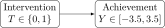
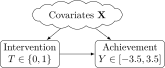
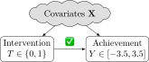
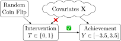
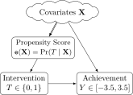
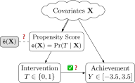
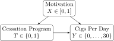

::: {.content-visible unless-format="revealjs"}

<center>
<a class="h2" href="./slides.html" target="_blank">Open slides in new window &rarr;</a>
</center>

:::

# Schedule {.smaller .crunch-title .crunch-callout .code-90 data-stack-name="Schedule"}

Today's Planned Schedule:

| | Start | End | Topic |
|:- |:- |:- |:- |
| **Lecture** | 6:30pm | 7:00pm | [Final Project Pep Talk &rarr;](#final-projects)
| | 7:00pm | 7:50pm | [Controlling For Things vs. Matching/Weighting &rarr;](#propensity-score-weighting) |
| **Break!** | 7:50pm | 8:00pm | |
| | 8:00pm | 9:00pm | [Propensity Score Lab &rarr;](#what-if-we-have-many-covariates) |

: {tbl-colwidths="[12,12,12,64]"}



::: {.hidden}

```{r}
#| label: r-source-globals
library(tidyverse)
source("../dsan-globals/stat_binscatter.r")
source("../dsan-globals/_globals.r")
```

:::

## Roadmap for Part 2 {.title-11}

* $\downarrow$ Focus on abstract concepts / terminology
* $\uparrow$ Focus on **data analysis**
* (Should hopefully start to feel more like other DSAN classes!)
* ($\Rightarrow$ Need you to take specific examples I pick and **analogize them** to your field(s) of interest)

# Final Projects {data-stack-name="Final Projects"}

* Notion! Then, choose a path (rough draft of paths):
  * <i class='bi bi-1-circle'></i> Modeling a social phenomenon with PGMs
  * <i class='bi bi-2-circle'></i> Taking an existing project/interest (e.g., from 5300) and **pushing towards the causality asymptote**
* Choose a path by **Tuesday, July 15, 6:30pm EDT** 

# Propensity Score Weighting {.title-11 .crunch-title .crunch-ul .crunch-quarto-layout-panel .crunch-img .text-75 .crunch-li-8 data-stack-name="Propensity Scores"}

:::: {layout="[60,40]" layout-valign="center"}
::: {#propensity-text}

* HW1 matching: similarity either **1** (applied to same schools) or **0** (didn't apply to same schools)
* Propensity scores: model ***quality* of match**
* $\Rightarrow$ Opens up (literally) infinite possibilities **between** 0 and 1!
* $\Rightarrow$ Use your **unsupervised learning** skills (matching via **clustering**)
* $\Rightarrow$ Use your **supervised learning** skills (propensity scores = **logistic regression** coefficients!)

:::
::: {#propensity-img}

\]](images/apple-orange.jpg){#fig-apple-orange fig-align="center"}

:::
::::

* $\Rightarrow$ Use your **diagnostic** skills: e.g., methods for **evaluating clusters** / preventing **overfitting**

## Working Example: Growth Mindset(!) {.smaller .title-09 .crunch-title .crunch-ul .table-90 .crunch-img .crunch-quarto-figure}

:::: {.columns}
::: {.column width="50%"}

* From @athey_estimating_2019
* **Treatment $T$**, called `intervention` in the dataset: a seminar on **growth mindset** for high school students
* **Outcome $Y$**, called `achievement_score` in the dataset: performance on state's standardized test
* In a perfect world, we could just compute

$$
\mathbb{E}[Y \mid T = 1] - \mathbb{E}[Y \mid T = 0]
$$

{fig-align="center" width="400"}

:::
::: {.column width="50%"}

```{r}
#| label: growth-data
#| fig-width: 3.5
#| fig-height: 3
library(tidyverse)
library(broom)
student_df <- read_csv("assets/learning_mindset.csv")
(mean_df <- student_df |> group_by(intervention) |> summarize(mean_score=mean(achievement_score)))
student_naive_lm <- lm(achievement_score ~ intervention, data=student_df)
student_naive_lm |> broom::tidy() |> select(term, estimate)
student_df |>
  ggplot(aes(x=intervention, y=achievement_score)) +
  geom_boxplot(
    aes(group=intervention),
    width=0.5
  ) +
  geom_smooth(
    method='lm',
    formula='y ~ x',
    se=TRUE
  ) +
  geom_point(
    data=mean_df,
    aes(x=intervention, y=mean_score),
    size=3
  ) +
  theme_dsan(base_size=16)
```

:::
::::

## The Problem: Pesky Covariates

* Here the "blob" $\mathbf{X}$ forms a **fork**, as drawn...
* But in reality the work of modeling is **flying into the cloud** and modeling the $\mathbf{X}$-$T$ and $\mathbf{X}$-$Y$ relationships (especially: figuring out which covariates $X_j \in \mathbf{X}$ are **colliders**), so you can **close the backdoors**:

:::: {layout="[1,1]" layout-valign="center"}

{fig-align="center" width="400"}

{fig-align="center" width="400"}

::::

* This can be really difficult, for a bunch of reasons... What if there was an easier way?

## If We Had Control Over Everything (Experiments vs. Observational Data Analysis) {.smaller .title-09}

* If we could **intervene in the DGP**, we could **assign treatment randomly**, thus ***removing*** the impact of Covariates on $T$!

{fig-align="center" width="360"}

* Alas, we are **data scientists**, not (necessarily) experiment-conductors, plus there are often **ethical reasons** to **not** perform experiments!
* ...There's still another approach!

## Closing Backdoors the Too-Good-To-Be-True Way {.crunch-title .title-07 .text-90 .crunch-p .crunch-img .crunch-quarto-layout-panel .crunch-quarto-figure .crunch-ul .crunch-li-7 .footnotes-0}

* Key insight from causal thinking: *Transformation* of the problem from "control for all covariates" to "close all backdoor paths"...
* For the goal of just closing these paths, we have an alternative^[For reasons we'll see later (double-robustness), you should ultimately try to achieve **both goals!**]:

:::: {.columns}
::: {.column width="60%"}

* @rosenbaum_central_1983: there exists a **statistic** $\mathtt{e}(\mathbf{X}) = \Pr(T \mid \mathbf{X})$, the **propensity score**, which "captures" info in $\textbf{X}$ relevant to $T$ such that
* **Conditioning on $\mathtt{e}(\mathbf{X})$ closes $\mathbf{X} \Rightarrow \mathtt{e}(\mathbf{X}) \rightarrow T$** ($\mathtt{e}(\mathbf{X})$ is a **pipe**)

:::
::: {.column width="40%"}

{fig-align="center" width="400"}

:::
::::

* This would close backdoor path $T \leftarrow \mathtt{e}(\mathbf{X}) \Leftarrow \mathbf{X} \rightarrow Y$, leaving only direct effect $T \rightarrow Y$! There's one remaining complication...

## Closing Backdoors via *Propensity Score Estimation* {.smaller .title-09 .crunch-title}

* Sadly we don't **observe** *true* probability of being treated for all possible values of $\mathbf{X}$
* But, we can derive an **estimate** $\hat{\mathtt{e}}(\mathbf{X})$ using our **machine learning skills** 😎
* We now have that $\hat{\mathtt{e}}(\mathbf{X})$, as a **proxy** relative to the **pipe** $\mathbf{X} \Rightarrow \mathtt{e}(\mathbf{X}) \rightarrow T$, **blocks** the pipe **to the extent that it captures the true probability $\mathtt{e}(\mathbf{X}) = \Pr(T \mid \mathbf{X})$**

:::: {layout="[60,40]" layout-valign="center"}
::: {#propensity-est-left}

{fig-align="right" width="520"}

:::
::: {#propensity-est-right}

* Backdoor Path: $T \leftarrow \mathtt{e}(\mathbf{X}) \Leftarrow \mathbf{X} \rightarrow Y$
* Closed **in proportion to** $\left[ \text{Cor}(\hat{\mathtt{e}}(\mathbf{X}), \mathtt{e}(\mathbf{X})) \right]^2 = ❓$

:::
::::

## Sometimes-Helpful Thought Experiment {.smaller .title-11 .crunch-title .crunch-ul .crunch-quarto-layout-panel .crunch-quarto-figure .crunch-img .crunch-li-8}

:::: {.columns}
::: {.column width="50%"}

* Back in our basic **confounding** scenario:
* If there was only one covariate ($\mathbf{X} = X$), and it was a **constant** ($\Pr(X = c) = 1$), then **all the variation in $Y$ would be due to variation in $T$**
* Less extreme: if person $i$ has covariates $\mathbf{X}_i$ and person $j$ has covariates $\mathbf{X}_j$, but $\mathbf{X}_i = \mathbf{X}_j$, then **variation in their outcomes** is **due solely to $T$**

{fig-align="center" width="80%"}

:::
::: {.column width="50%"}

* Part of the logic of **propensity score** is that, if person $i$ has covariates $\mathbf{X}_i$ and person $j$ has covariates $\mathbf{X}_j$, but $\mathtt{e}(\mathbf{X}_i) = \mathtt{e}(\mathbf{X}_j)$, then $i$ and $j$ are **perfectly matched**
* $\Rightarrow$ (by fun math proof) **variation in their outcomes** is **due solely to $T$**

{fig-align="center" width="80%"}

:::
::::

## How Exactly Do We *Adjust For* $\hat{\mathtt{e}}(\mathbf{X})$? {.smaller .title-12 .crunch-quarto-figure .crunch-img .crunch-p}

::: {style="width: 100%"}

* Simulation example: smoking reduction

:::

:::: {.columns}
::: {.column width="40%"}

```{r}
#| label: naive-smoking-model
library(tidyverse)
library(Rlab)
set.seed(5650)
n <- 250
motiv_vals <- runif(n, 0, 1)
enroll_vals <- ifelse(
  motiv_vals < 0.25,
  0,
  # We know motiv > 0.25
  ifelse(
    motiv_vals > 0.75,
    1,
    # We know 0.25 < motiv < 0.75
    rbern(n, prob=(motiv_vals - 0.125)*1.5)
  )
)
ncigs_vals <- rbinom(n, size=30, prob=0.6-0.2*enroll_vals)
smoke_df <- tibble(
  motiv=motiv_vals,
  enroll=enroll_vals,
  ncigs=ncigs_vals
)
(smoke_mean_df <- smoke_df |> group_by(enroll) |> summarize(mean_ncigs=mean(ncigs)))
naive_smoke_lm <- lm(ncigs ~ enroll, data=smoke_df)
summary(naive_smoke_lm) |> broom::tidy() |>
  select(term, estimate)
```

:::
::: {.column width="60%"}

{fig-align="center" width="70%"}

```{r}
#| label: smoke-naive-plot
smoke_df |> ggplot(aes(x=enroll, y=ncigs)) +
  geom_boxplot(
    aes(group=enroll),
    width=0.5
  ) +
  geom_smooth(
    method='lm',
    formula='y ~ x',
    se=TRUE
  ) +
  geom_point(
    data=smoke_mean_df,
    aes(x=enroll, y=mean_ncigs),
    size=3
  ) +
  theme_dsan(base_size=24)
```

:::
::::

## Inverse Probability-of-Treatment Weighting {.smaller .crunch-title .title-11 .crunch-img .crunch-quarto-figure .crunch-p}

:::: {.columns}
::: {.column width="50%"}

```{r}
#| label: motive-ncigs-plot
eprop_model <- glm(enroll ~ motiv, family='binomial', data=smoke_df)
eprop_preds <- predict(eprop_model, type="response")
smoke_df <- smoke_df |> mutate(pred=eprop_preds)
# Use the preds to compute IPW
smoke_df <- smoke_df |> rowwise() |> mutate(
  ipw=ifelse(enroll, 1/pred, 1/(1-pred))
) |> arrange(pred)
#smoke_df
smoke_df |> mutate(enroll=factor(enroll)) |>
  ggplot(aes(x=motiv, y=ncigs, color=enroll)) +
  geom_point() +
  theme_dsan(base_size=24) +
  labs(title="Before Weighting")
```

:::
::: {.column width="50%"}

```{r}
#| label: ipw-plot
smoke_df |> mutate(enroll=factor(enroll)) |>
  ggplot(aes(
    x=motiv, y=ncigs, color=enroll, size=ipw,
    alpha=log(ipw-1)
  )) +
  geom_point() +
  guides(alpha="none") +
  theme_dsan(base_size=24) +
  labs(title="After Weighting")
```

:::
::::

:::: {layout="[48,4,48]" layout-valign="center"}
::: {#iptw-bottom-left}

<center>

&darr;

</center>

```{r}
#| label: enroll-propensity
smoke_df |>
  ggplot(aes(x=motiv)) +
  # Predictions
  geom_point(
    aes(y=enroll, color=factor(enroll))
  ) +
  # Values
  geom_point(
    aes(y=pred, color=factor(enroll))
  ) +
  labs(color="enroll") +
  theme_dsan(base_size=24) +
  labs(title="Propensity to Enroll")
```

:::
::: {#iptw-bottom-middle}

<center>

&rarr;

</center>

:::
::: {#iptw-bottom-right}

<center>

&uarr;

</center>

```{r}
#| label: enroll-ipw
ipw_min <- min(smoke_df$ipw)
ipw_max <- max(smoke_df$ipw)
smoke_df <- smoke_df |> mutate(
  ipw_scaled = (ipw - ipw_min) / (ipw_max - ipw_min)
)
smoke_df |>
  ggplot(aes(x=motiv)) +
  # Predictions
  geom_point(
    aes(y=enroll, color=factor(enroll))
  ) +
  # Values
  geom_point(
    aes(y=ipw_scaled, color=factor(enroll))
  ) +
  theme_dsan(base_size=24) +
  labs(
    title="Inverse Probability-of-Treatment Weights (IPTW)",
    color="enroll"
  )
```

:::
::::

## The Final Result! {.smaller .crunch-title .crunch-p}

```{r}
#| label: ipw-reg
#| output-location: column
#| code-fold: show
lm_with_weights <- lm(ncigs ~ enroll,
  data=smoke_df, weights=smoke_df$ipw
)
summary(lm_with_weights) |> broom::tidy() |>
  select(term, estimate, std.error)
```

```{r}
#| label: ipw-library
#| code-fold: show
#| output-location: column
library(WeightIt)
W <- weightit(
  enroll ~ motiv, data = smoke_df, ps="pred"
)
smoke_weighted_lm <- lm_weightit(
  ncigs ~ enroll, data = smoke_df, weightit = W
)
summary(smoke_weighted_lm, ci = FALSE)
```

```{r}
#| label: ipw2
#| code-fold: show
#| output-location: column
W_default <- weightit(enroll ~ motiv, data = smoke_df)
smoke_default_lm <- lm_weightit(
  ncigs ~ enroll, data = smoke_df,
  weightit = W_default
)
summary(smoke_default_lm, ci = FALSE)
```

# ...What If We Have *Many* Covariates? {data-stack-name="Many Covariates"}

* Curse of dimensionality...
* Lab Time!

## References

::: {#refs}
:::
