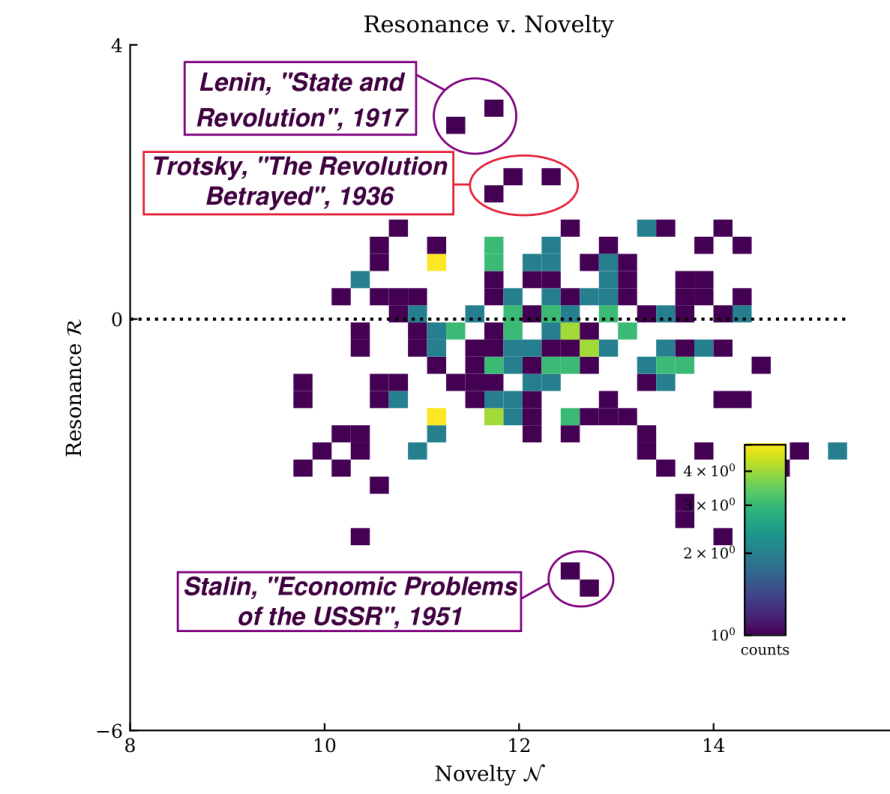

::: {.content-visible unless-format="revealjs"}

<a class="h2" href="./slides.html" target="_blank">Open slides in new window &rarr;</a>

:::

# Final Project Drafts: Friday, 5:59pm EDT {data-name="Final Projects"}

* On Canvas!
* Think of it as a **skeleton** of the final project
* Final submission = draft + missing pieces filled in

# Topic Models Over Space and Time {data-stack-name="Topic Models"}

## Topic Models {.smaller .crunch-title .crunch-ul .table-90}

* Intuition is just: let's model **latent topics** "underlying" **observed words**

| Section | Keywords |
| - | - |
| U.S. News | state, court, federal, republican |
| World News | government, country, officials, minister |
| Arts | music, show, art, dance |
| Sports | game, league, team, coach |
| Real Estate | home, bedrooms, bathrooms, building |

* Already, by just classifying articles based on these keyword counts:

| | Arts | Real Estate | Sports | U.S. News | World News | Total |
|-:|:-:|:-:|:-:|:-:|:-:|
| **Correct** | 3020 | 690 | 4860 | 1330 | 1730 | 11630 |
| **Incorrect** | 750 | 60 | 370 | 1100 | 590 | 2870 |
| **Accuracy** | 0.801 | 0.920 | 0.929 | 0.547 | 0.746 | 0.802 |

## Topic Models as PGMs {.smaller .crunch-title .crunch-img}

{fig-align="center"}

*...Unlocks a world of social modeling through text!*

## Cross-Sectional Analysis

@blaydes_mirrors_2018

## Influence Over Time

{fig-align="center"}

## Textual Influence Over Time

{fig-align="center"}

# Sensitivity Analysis 1: Sensitivity to Priors {data-stack-name="Sensitivity to Priors"}

## References

::: {#refs}
:::
