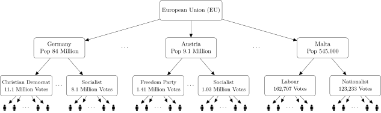
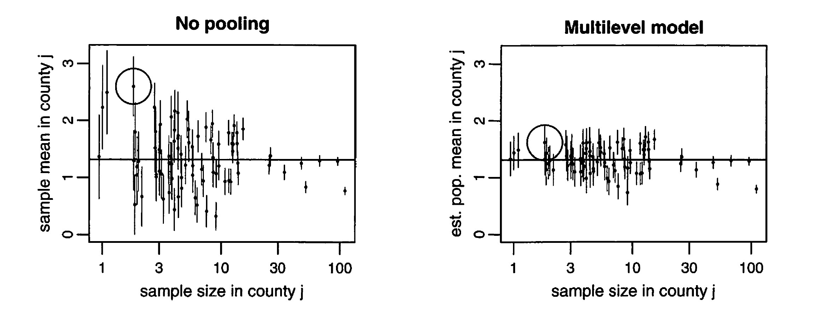
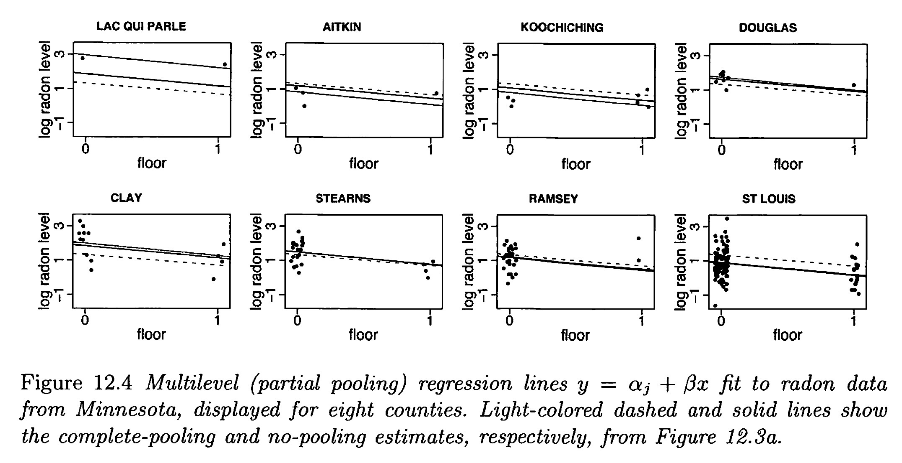
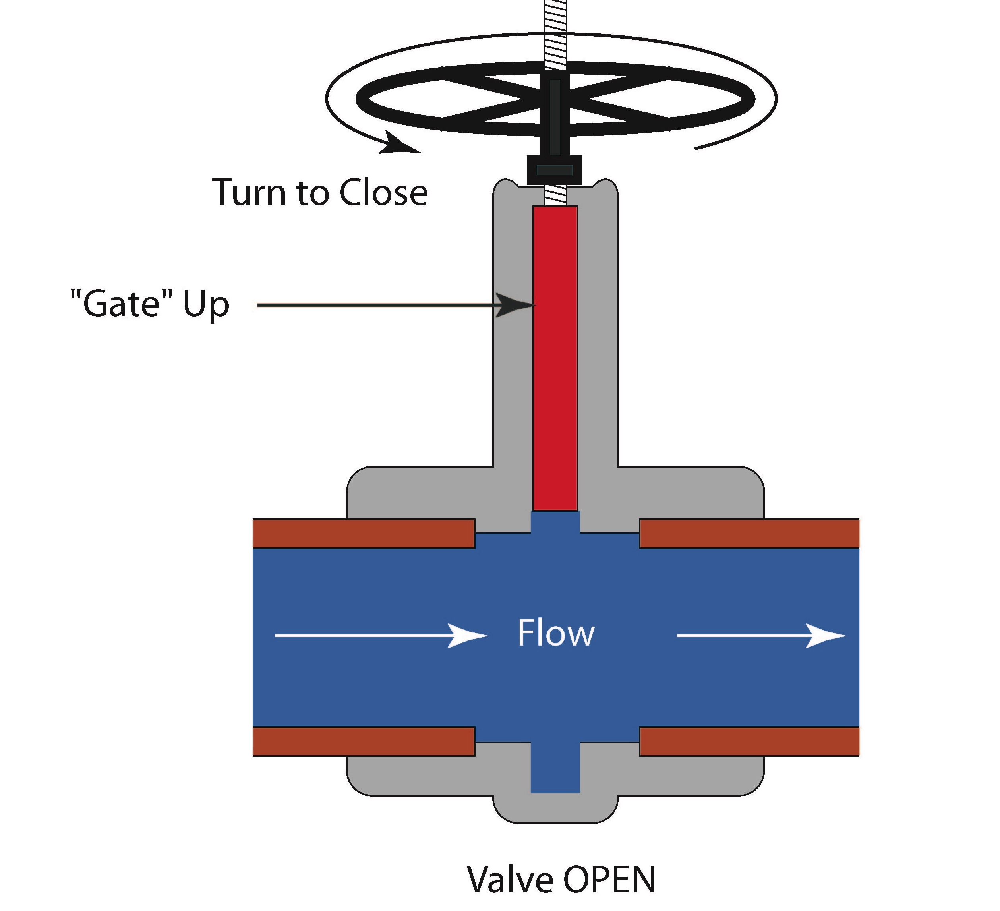
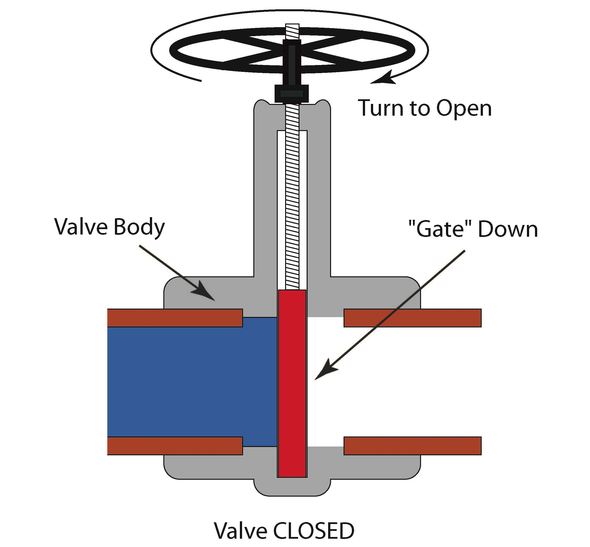
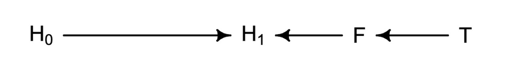
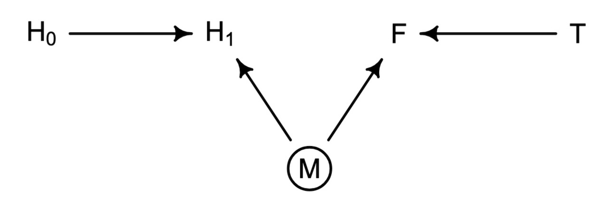

::: {.content-visible unless-format="revealjs"}

<center>
<a class="h2" href="./slides.html" target="_blank">Open slides in new window &rarr;</a>
</center>

:::

# Schedule {.smaller .crunch-title .crunch-callout .code-90 data-name="Schedule"}

Today's Planned Schedule:

| | Start | End | Topic |
|:- |:- |:- |:- |
| **Lecture** | 6:30pm | 7:20pm | [Multilevel Madness &rarr;](#multilevel-madness) |
| | 7:20pm | 7:50pm | [Applying $\textsf{do}()$ &rarr;](#the-ladder-of-causal-inference) |
| **Break!** | 7:50pm | 8:00pm | |
| | 8:00pm | 9:00pm | [Closing Backdoor Paths &rarr;](#the-collider) |

: {tbl-colwidths="[12,12,12,64]"}



::: {.hidden}

```{r}
#| label: r-source-globals
source("../dsan-globals/_globals.r")
```

:::

# Multilevel Madness {.smaller data-name="Multilevel Madness"}

{fig-align="center"}

<center>

..."Lab" Time!

</center>

## Pooling: None, Full, and Adaptive {.smaller .crunch-title}

{fig-align="center"}

$$
\hat{\alpha}_j^{\text {multilevel }} = \frac{\frac{n_j}{\sigma_y^2} \bar{y}_j+\frac{1}{\sigma_\alpha^2} \bar{y}_{\text {all }}}{\frac{n_j}{\sigma_y^2}+\frac{1}{\sigma_\alpha^2}}
$$

## Why Adaptive >> None or Full? {.smaller .crunch-title}

{fig-align="center"}

$$
\alpha_j \sim \mathcal{N}(\mu_\alpha, \sigma_\alpha), \text{ for }j = 1, \ldots, J
$$

* In the limit of $\sigma_\alpha \rightarrow \infty$, the soft constraints do nothing, and there is no pooling;
* As $\sigma_\alpha \rightarrow 0$, they pull the estimates all the way to zero, yielding the complete-pooling estimate

# The Four Elemental Confounds {.smaller .crunch-title .crunch-quarto-figure .title-12 .crunch-quarto-layout-panel data-stack-name="Forks, Pipes, Colliders"}

](images/elemental-confounds.png){fig-align="center"}

```{r}
#| label: r-libraries
#| echo: true
#| code-fold: true
library(tidyverse) # For ggplot
library(extraDistr) # For rbern()
library(patchwork) # For side-by-side plotting
library(ggtext) # For colors in titles
library(rethinking)
library(dagitty)
n_d <- 10000 # For discrete RVs
n_c <- 300 # For continuous RVs
```

## Pipes $X \rightarrow Z \rightarrow Y$: Conditioning = *Blocking* {.smaller .crunch-title .title-10 .crunch-quarto-figure .crunch-quarto-layout-panel .crunch-img .crunch-figure .crunch-p}

:::: {layout="[30,20,50]" layout-valign="center" layout-align="center"}
::: {#pipe-open}

{fig-align="center" width="190"}

{fig-align="center" width="240"}

:::
::: {#pipe-dag-img}

```{r}
#| label: pipe-dag
#| fig-align: center
#| fig-width: 7
#| fig-height: 4.5
#| results: hold
library(rethinking)
library(dagitty)
library(ggdag)
source("mydrawdag.r")
pipe_dag <- dagitty("dag{
X[exposure]
Y[outcome]
X -> Y
X -> Z
Z -> Y
}")
coordinates(pipe_dag) <- list(
    x=c(X=0, Z=0.5, Y=1),
    y=c(X=1, Z=0.5, Y=1)
)
drawdag_jj(
  pipe_dag, cex=5, lwd=5,
)
drawopenpaths_jj(
  pipe_dag, cex=5, lwd=5,
)
adj_sets <- adjustmentSets(
    pipe_dag, effect="direct"
)
writeLines("Adjustment sets (direct effect):")
adj_sets
```

:::
::: {#pipe-plot}

```{r}
#| label: pipe-continuous
#| echo: true
#| code-fold: true
#| fig-width: 4.5
#| fig-height: 3
set.seed(5650)
cpipe_df <- tibble(
    X = rnorm(n_c),
    Z = rbern(n_c, plogis(X)),
    Y = rnorm(n_c, 2 * Z - 1)
)
cpipe_lm <- lm(Y ~ X, data=cpipe_df)
cpipe_slope <- round(cpipe_lm$coef['X'], 3)
cpipe_z0_lm <- lm(Y ~ X, data=cpipe_df |> filter(Z == 0))
cpipe_z0_slope <- round(cpipe_z0_lm$coef['X'], 2)
cpipe_z0_label <- paste0("<span style='color: #e69f00;'>Slope<sub>Z=0</sub> = ",cpipe_z0_slope,"</span>")
cpipe_z1_lm <- lm(Y ~ X, data=cpipe_df |> filter(Z == 1))
cpipe_z1_slope <- round(cpipe_z1_lm$coef['X'], 2)
cpipe_z1_label <- paste0("<span style='color: #56b4e9;'>Slope<sub>Z=1</sub> = ",cpipe_z1_slope,"</span>")
cpipe_z_texlabel <- paste0(cpipe_z0_label, " | ", cpipe_z1_label)
cpipe_xmin <- min(cpipe_df$X)
cpipe_xmax <- max(cpipe_df$X)
ggplot() +
  # Points
  geom_point(
    data=cpipe_df |> filter(Y > -3),
    aes(x=X, y=Y, color=factor(Z)),
    size=0.4*g_pointsize,
    alpha=0.8
  ) +
  # Overall lm
  geom_smooth(
    data=cpipe_df, aes(x=X, y=Y),
    method = lm, se = FALSE,
    linewidth = 2.75, color='white'
  ) +
  geom_smooth(
    data=cpipe_df, aes(x=X, y=Y),
    method = lm, se = FALSE,
    linewidth = 2, color='black'
  ) +
  theme_dsan(base_size=18) +
  theme(
    plot.title = element_text(size=18),
    plot.subtitle = element_markdown(size=16)
  ) +
  # coord_equal() +
  labs(
    title = paste0(
      "Unstratified Slope = ",cpipe_slope
    ),
    x = "X", y = "Y", color = "Z"
  )
```

:::
::::

<!-- Pipe Blocked -->

:::: {layout="[30,20,50]" layout-valign="center" layout-align="center"}
::: {#pipe-closed}

{fig-align="center" width="190"}

{fig-align="center" width="240"}

:::
::: {#pipe-dag-closed-img}

```{r}
#| label: pipe-dag-closed
#| fig-align: center
#| fig-width: 7
#| fig-height: 4.5
#| results: hold
library(rethinking)
library(dagitty)
library(ggdag)
pipe_dag_closed <-dagitty("dag{
X[exposure]
Y[outcome]
Z[adjustedNode]
X -> Y
X -> Z
Z -> Y
}")
coordinates(pipe_dag_closed) <- list(
    x=c(X=0, Z=0.5, Y=1),
    y=c(X=1, Z=0.5, Y=1)
)
drawdag_jj(
  pipe_dag_closed, cex=4, lwd=5, radius=10
)
drawopenpaths_jj(
  pipe_dag_closed, Z="Z", lwd=5
)
adj_sets_closed <- adjustmentSets(
    pipe_dag_closed
)
writeLines("Adjustment sets (direct effect):")
adj_sets_closed
```

:::
::: {#pipe-plot}

```{r}
#| label: pipe-continuous-closed
#| echo: true
#| code-fold: true
#| fig-width: 4.5
#| fig-height: 3
set.seed(5650)
cpipe_df <- tibble(
    X = rnorm(n_c),
    Z = rbern(n_c, plogis(X)),
    Y = rnorm(n_c, 2 * Z - 1)
)
cpipe_lm <- lm(Y ~ X, data=cpipe_df)
cpipe_slope <- round(cpipe_lm$coef['X'], 3)
cpipe_z0_lm <- lm(Y ~ X, data=cpipe_df |> filter(Z == 0))
cpipe_z0_slope <- round(cpipe_z0_lm$coef['X'], 2)
cpipe_z0_label <- paste0("<span style='color: #e69f00;'>Slope<sub>Z=0</sub> = ",cpipe_z0_slope,"</span>")
cpipe_z1_lm <- lm(Y ~ X, data=cpipe_df |> filter(Z == 1))
cpipe_z1_slope <- round(cpipe_z1_lm$coef['X'], 2)
cpipe_z1_label <- paste0("<span style='color: #56b4e9;'>Slope<sub>Z=1</sub> = ",cpipe_z1_slope,"</span>")
cpipe_z_texlabel <- paste0(cpipe_z0_label, " | ", cpipe_z1_label)
cpipe_xmin <- min(cpipe_df$X)
cpipe_xmax <- max(cpipe_df$X)
ggplot() +
  # Points
  geom_point(
    data=cpipe_df |> filter(Y > -3),
    aes(x=X, y=Y, color=factor(Z)),
    size=0.4*g_pointsize,
    alpha=0.8
  ) +
  # geom_smooth(
  #   data=cpipe_df, aes(x=X, y=Y),
  #   method = lm, se = FALSE,
  #   linewidth = 2.75, color='white'
  # ) +
  # geom_smooth(
  #   data=cpipe_df, aes(x=X, y=Y),
  #   method = lm, se = FALSE,
  #   linewidth = 2, color='black'
  # ) +
  # Stratified lm
  # (slightly larger black lines)
  geom_smooth(
    data=cpipe_df,
    aes(x=X, y=Y, group=factor(Z)),
    method=lm, se=FALSE, fullrange=TRUE,
    linewidth=2.75, color='black'
  ) +
  # (Colored lines)
  geom_smooth(
    data=cpipe_df,
    aes(x=X, y=Y, color=factor(Z)),
    method=lm, se=FALSE, fullrange=TRUE,
    linewidth=2
  ) +
  theme_dsan(base_size=18) +
  theme(
    plot.title = element_markdown(size=18),
    plot.subtitle = element_markdown(size=16)
  ) +
  # coord_equal() +
  labs(
    title=cpipe_z_texlabel,
    x = "X", y = "Y", color = "Z"
  )
```

:::
::::

## Forks $X \leftarrow Z \rightarrow Y$: Conditioning = *Blocking* {.smaller .crunch-title .title-10 .crunch-quarto-figure .crunch-quarto-layout-panel .crunch-img .crunch-figure .crunch-p}

:::: {layout="[30,20,50]" layout-valign="center" layout-align="center"}
::: {#pipe-open}

{fig-align="center" width="190"}

{fig-align="center" width="240"}

:::
::: {#fork-dag-img}

```{r}
#| label: fork-dag-open
#| fig-align: center
#| fig-width: 7
#| fig-height: 4.5
#| results: hold
library(rethinking)
library(dagitty)
library(ggdag)
pipe_dag <-dagitty("dag{
X[exposure]
Y[outcome]
X -> Y
Z -> X
Z -> Y
}")
coordinates(pipe_dag) <- list(
    x=c(X=0, Z=0.5, Y=1),
    y=c(X=1, Z=0.5, Y=1)
)
drawdag_jj(pipe_dag, cex=5, lwd=5)
drawopenpaths_jj(pipe_dag, cex=5, lwd=5)
adj_sets <- adjustmentSets(
    pipe_dag, effect="direct"
)
writeLines("Adjustment sets (direct effect):")
adj_sets
```

:::
::: {#open-fork-plot}

```{r}
#| label: open-fork-continuous
#| echo: true
#| code-fold: true
#| fig-width: 4.5
#| fig-height: 3
library(ggtext)
set.seed(5650)
cfork_df <- tibble(
    Z = rbern(n_c),
    X = rnorm(n_c, 2 * Z - 1),
    Y = rnorm(n_c, 2 * Z - 1)
)
library(latex2exp)
overall_lm <- lm(Y ~ X, data=cfork_df)
overall_slope <- round(overall_lm$coef['X'], 3)
z0_lm <- lm(Y ~ X, data=cfork_df |> filter(Z == 0))
z0_slope <- round(z0_lm$coef['X'], 2)
z0_label <- paste0("<span style='color: #e69f00;'>Slope<sub>Z=0</sub> = ",z0_slope,"</span>")
z1_lm <- lm(Y ~ X, data=cfork_df |> filter(Z == 1))
z1_slope <- round(z1_lm$coef['X'], 2)
z1_label <- paste0("<span style='color: #56b4e9;'>Slope<sub>Z=1</sub> = ",z1_slope,"</span>")
z_texlabel <- paste0(z0_label, " | ", z1_label)
cfork_xmin <- min(cfork_df$X)
cfork_xmax <- max(cfork_df$X)
ggplot() +
  # Points
  geom_point(
    data=cfork_df,
    aes(x=X, y=Y, color=factor(Z)),
    size=0.4*g_pointsize,
    alpha=0.8
  ) +
  # Overall lm
  geom_smooth(
    data=cfork_df, aes(x=X, y=Y),
    method = lm, se = FALSE,
    linewidth = 2.75, color='white'
  ) +
  geom_smooth(
    data=cfork_df, aes(x=X, y=Y),
    method = lm, se = FALSE,
    linewidth = 2, color='black'
  ) +
  theme_dsan(base_size=18) +
  theme(
    plot.title = element_text(size=18),
    plot.subtitle = element_markdown(size=16)
  ) +
  # coord_equal() +
  labs(
    title = paste0(
      "Unstratified Slope = ",overall_slope
    ),
    x = "X", y = "Y", color = "Z"
  )
```

:::
::::

<!-- Fork Blocked -->

:::: {layout="[30,20,50]" layout-valign="center" layout-align="center"}
::: {#fork-closed}

{fig-align="center" width="190"}

{fig-align="center" width="240"}

:::
::: {#fork-dag-closed-img}

```{r}
#| label: fork-dag-closed
#| fig-align: center
#| fig-width: 7
#| fig-height: 4.5
#| results: hold
fork_dag_closed <-dagitty("dag{
X[exposure]
Y[outcome]
Z[adjustedNode]
X -> Y
Z -> X
Z -> Y
}")
coordinates(fork_dag_closed) <- list(
    x=c(X=0, Z=0.5, Y=1),
    y=c(X=1, Z=0.5, Y=1)
)
fork_dag_closed <- setVariableStatus(
  fork_dag_closed, "adjustedNode", "Z"
)
drawdag_jj(
  fork_dag_closed, cex=5, lwd=5
)
drawopenpaths_jj(
  fork_dag_closed, Z="Z", lwd=5
)
```

:::
::: {#fork-plot}

```{r}
#| label: fork-continuous
#| echo: true
#| code-fold: true
#| fig-width: 4.5
#| fig-height: 3
library(ggtext)
set.seed(5650)
cfork_df <- tibble(
    Z = rbern(n_c),
    X = rnorm(n_c, 2 * Z - 1),
    Y = rnorm(n_c, 2 * Z - 1)
)
library(latex2exp)
overall_lm <- lm(Y ~ X, data=cfork_df)
overall_slope <- round(overall_lm$coef['X'], 3)
z0_lm <- lm(Y ~ X, data=cfork_df |> filter(Z == 0))
z0_slope <- round(z0_lm$coef['X'], 2)
z0_label <- paste0("<span style='color: #e69f00;'>Slope<sub>Z=0</sub> = ",z0_slope,"</span>")
z1_lm <- lm(Y ~ X, data=cfork_df |> filter(Z == 1))
z1_slope <- round(z1_lm$coef['X'], 2)
z1_label <- paste0("<span style='color: #56b4e9;'>Slope<sub>Z=1</sub> = ",z1_slope,"</span>")
z_texlabel <- paste0(z0_label, " | ", z1_label)
cfork_xmin <- min(cfork_df$X)
cfork_xmax <- max(cfork_df$X)
ggplot() +
  # Points
  geom_point(
    data=cfork_df,
    aes(x=X, y=Y, color=factor(Z)),
    size=0.4*g_pointsize,
    alpha=0.8
  ) +
  # Overall lm
  # geom_smooth(
  #   data=cfork_df, aes(x=X, y=Y),
  #   method = lm, se = FALSE,
  #   linewidth = 2.75, color='white'
  # ) +
  # geom_smooth(
  #   data=cfork_df, aes(x=X, y=Y),
  #   method = lm, se = FALSE,
  #   linewidth = 2, color='black'
  # ) +
  # Stratified lm
  # (slightly larger black lines)
  geom_smooth(
    data=cfork_df,
    aes(x=X, y=Y, group=factor(Z)),
    method=lm, se=FALSE, fullrange=TRUE,
    linewidth=2.75, color='black'
  ) +
  # (Colored lines)
  geom_smooth(
    data=cfork_df,
    aes(x=X, y=Y, color=factor(Z)),
    method=lm, se=FALSE, fullrange=TRUE,
    linewidth=2
  ) +
  theme_dsan(base_size=18) +
  theme(
    plot.title = element_text(size=18),
    plot.subtitle = element_markdown(size=16)
  ) +
  # coord_equal() +
  labs(
    # title = paste0(
    #   "Unstratified Slope = ",overall_slope
    # ),
    # subtitle=z_texlabel,
    subtitle=z_texlabel,
    x = "X", y = "Y", color = "Z"
  )
```

:::
::::

## Conditioning on a Proxy for $Z$ {.smaller .crunch-title .title-10 .crunch-quarto-figure .crunch-ul .crunch-li-5 .crunch-quarto-layout-panel .crunch-img}

:::: {layout="[65,35]" layout-valign="center" layout-align="center"}
::: {#proxy-text}

* With just $X \rightarrow Z \rightarrow Y$, we'd have a **pipe**
* Observing $A \Rightarrow$ **some** (not all!) info about $Z$

:::
::: {#proxy-img}

{fig-align="center" width="200"}

:::
::::

<!-- Continuous Proxy Plot -->

```{r}
#| label: prox-continuous
#| echo: true
#| code-fold: true
#| fig-width: 6.5
#| fig-height: 5
library(tidyverse)
library(extraDistr)
library(latex2exp)
set.seed(5650)
cprox_df <- tibble(
    X = rnorm(n_c),
    Z = rbern(n_c, plogis(X)),
    Y = rnorm(n_c, 2 * Z - 1),
    A = rbern(n_c, (1-Z)*0.86 + Z*0.14)
)
cprox_lm <- lm(Y ~ X, data=cprox_df)
cprox_slope <- round(cprox_lm$coef['X'], 3)
cprox_a0_lm <- lm(Y ~ X, data=cprox_df |> filter(A == 0))
cprox_a0_slope <- round(cprox_a0_lm$coef['X'], 2)
cprox_a0_label <- paste0("<span style='color: #e69f00;'>Slope<sub>Z=0</sub> = ",cprox_a0_slope,"</span>")
# A == 1 lm
cprox_a1_lm <- lm(Y ~ X, data=cprox_df |> filter(A == 1))
cprox_a1_slope <- round(cprox_a1_lm$coef['X'], 2)
cprox_a1_label <- paste0("<span style='color: #56b4e9;'>Slope<sub>Z=1</sub> = ",cprox_a1_slope,"</span>")
cprox_a_texlabel <- paste0(cprox_a0_label, " | ", cprox_a1_label)
cprox_xmin <- min(cprox_df$X)
cprox_xmax <- max(cprox_df$X)
ggplot() +
  # Points
  geom_point(
    data=cprox_df |> filter(Y > -3),
    aes(x=X, y=Y, color=factor(A)),
    size=0.5*g_pointsize,
    alpha=0.8
  ) +
  # Overall lm
  geom_smooth(
    data=cprox_df, aes(x=X, y=Y),
    method = lm, se = FALSE,
    linewidth = 2.5, color='black'
  ) +
  # Stratified lm
  # (slightly larger black lines)
  geom_smooth(
    data=cprox_df,
    aes(x=X, y=Y, group=factor(A)),
    method=lm, se=FALSE, fullrange=TRUE,
    linewidth=2.75, color='black'
  ) +
  # (Colored lines)
  geom_smooth(
    data=cprox_df,
    aes(x=X, y=Y, color=factor(A)),
    method=lm, se=FALSE, fullrange=TRUE,
    linewidth=2
  ) +
  theme_dsan(base_size=20) +
  theme(
    plot.title = element_text(size=20),
    plot.subtitle = element_markdown(size=18)
  ) +
  # coord_equal() +
  labs(
    title = paste0(
      "Unstratified Slope = ",cprox_slope
    ),
    subtitle=cprox_a_texlabel,
    x = "X", y = "Y", color = "A"
  )
```

## ⚠️Colliders⚠️ $X \rightarrow Z \leftarrow Y$: Conditioning = *Opening* {.smaller .crunch-title .title-09 .crunch-quarto-figure .crunch-ul .crunch-li-5 .crunch-p .crunch-img .crunch-quarto-layout-panel .crunch-figure}

:::: {layout="[30,20,50]" layout-valign="center" layout-align="center"}
::: {#collider-open}

{fig-align="center" width="190"}

{fig-align="center" width="240"}

:::
::: {#collider-dag-img}

```{r}
#| label: collider-dag-unobs
#| fig-align: center
#| fig-width: 7
#| fig-height: 4.5
#| results: hold
library(rethinking)
library(dagitty)
library(ggdag)
coll_dag <-dagitty("dag{
X[exposure]
Y[outcome]
X -> Y
X -> Z
Y -> Z
}")
coordinates(coll_dag) <- list(
    x=c(X=0, Z=0.5, Y=1),
    y=c(X=1, Z=0.5, Y=1)
)
drawdag_jj(
  coll_dag, cex=5, lwd=5
)
drawopenpaths_jj(coll_dag, lwd=5)
adj_sets_coll <- adjustmentSets(
    coll_dag, effect="direct"
)
writeLines("Adjustment sets (direct effect):")
adj_sets_coll
```

:::
::: {#open-collider-plot}

```{r}
#| label: collider-unobs
#| echo: true
#| code-fold: true
#| fig-width: 4.5
#| fig-height: 3
set.seed(5650)
ccoll_df <- tibble(
    X = rnorm(n_c),
    Y = rnorm(n_c),
    Z = rbern(n_c, plogis(2 * (X + Y - 1)))
)
ccoll_lm <- lm(Y ~ X, data=ccoll_df)
ccoll_slope <- round(ccoll_lm$coef['X'], 3)
ccoll_z0_lm <- lm(Y ~ X, data=ccoll_df |> filter(Z == 0))
ccoll_z0_slope <- round(ccoll_z0_lm$coef['X'], 2)
ccoll_z0_label <- paste0("<span style='color: #e69f00;'>Slope<sub>Z=0</sub> = ",ccoll_z0_slope,"</span>")
ccoll_z1_lm <- lm(Y ~ X, data=ccoll_df |> filter(Z == 1))
ccoll_z1_slope <- round(ccoll_z1_lm$coef['X'], 2)
ccoll_z1_label <- paste0("<span style='color: #56b4e9;'>Slope<sub>Z=1</sub> = ",ccoll_z1_slope,"</span>")
ccoll_z_texlabel <- paste0(ccoll_z0_label, " | ", ccoll_z1_label)
ccoll_xmin <- min(ccoll_df$X)
ccoll_xmax <- max(ccoll_df$X)
ggplot() +
  # Points
  geom_point(
    data=ccoll_df |> filter(Y > -3),
    aes(x=X, y=Y, color=factor(Z)),
    size=0.4*g_pointsize,
    alpha=0.8
  ) +
  # Overall lm
  geom_smooth(
    data=ccoll_df, aes(x=X, y=Y),
    method = lm, se = FALSE,
    linewidth = 2.75, color='white'
  ) +
  geom_smooth(
    data=ccoll_df, aes(x=X, y=Y),
    method = lm, se = FALSE,
    linewidth = 2, color='black'
  ) +
  theme_dsan(base_size=18) +
  theme(
    plot.title = element_markdown(size=18),
    plot.subtitle = element_markdown(size=16)
  ) +
  # coord_equal() +
  labs(
    # title=ccoll_z_texlabel,
    title=paste0("Unstratified Slope = ",ccoll_slope),
    x = "X", y = "Y", color = "Z"
  )
```

:::
::::

<!-- Collider Observed -->

:::: {layout="[30,20,50]" layout-valign="center" layout-align="center"}
::: {#fork-closed}

{fig-align="center" width="190"}

{fig-align="center" width="240"}

:::
::: {#collider-dag-obs-img}

```{r}
#| label: collider-dag-obs
#| fig-align: center
#| fig-width: 7
#| fig-height: 4.5
#| results: hold
library(rethinking)
library(dagitty)
library(ggdag)
fork_dag_closed <- dagitty("dag{
X[exposure]
Y[outcome]
Z[adjustedNode]
X -> Y
X -> Z
Y -> Z
}")
coordinates(fork_dag_closed) <- list(
    x=c(X=0, Z=0.5, Y=1),
    y=c(X=1, Z=0.5, Y=1)
)
fork_dag_closed <- setVariableStatus(
  fork_dag_closed, "adjustedNode", "Z"
)
drawdag_jj(
  fork_dag_closed,
  cex=5, lwd=5,
)
drawopenpaths_jj(
  fork_dag_closed, Z="Z", lwd=5
)
```

{width="160" fig-align="center"}

:::
::: {#collider-obs-plot}

```{r}
#| label: collider-obs
#| echo: true
#| code-fold: true
#| fig-width: 4.5
#| fig-height: 3
set.seed(5650)
ccoll_df <- tibble(
    X = rnorm(n_c),
    Y = rnorm(n_c),
    Z = rbern(n_c, plogis(2 * (X + Y - 1)))
)
ccoll_lm <- lm(Y ~ X, data=ccoll_df)
ccoll_slope <- round(ccoll_lm$coef['X'], 3)
ccoll_z0_lm <- lm(Y ~ X, data=ccoll_df |> filter(Z == 0))
ccoll_z0_slope <- round(ccoll_z0_lm$coef['X'], 2)
ccoll_z0_label <- paste0("<span style='color: #e69f00;'>Slope<sub>Z=0</sub> = ",ccoll_z0_slope,"</span>")
ccoll_z1_lm <- lm(Y ~ X, data=ccoll_df |> filter(Z == 1))
ccoll_z1_slope <- round(ccoll_z1_lm$coef['X'], 2)
ccoll_z1_label <- paste0("<span style='color: #56b4e9;'>Slope<sub>Z=1</sub> = ",ccoll_z1_slope,"</span>")
ccoll_z_texlabel <- paste0(ccoll_z0_label, " | ", ccoll_z1_label)
ccoll_xmin <- min(ccoll_df$X)
ccoll_xmax <- max(ccoll_df$X)
ggplot() +
  # Points
  geom_point(
    data=ccoll_df |> filter(Y > -3),
    aes(x=X, y=Y, color=factor(Z)),
    size=0.4*g_pointsize,
    alpha=0.8
  ) +
  # Stratified lm
  # (slightly larger black lines)
  geom_smooth(
    data=ccoll_df,
    aes(x=X, y=Y, group=factor(Z)),
    method=lm, se=FALSE, fullrange=TRUE,
    linewidth=2.75, color='black'
  ) +
  # (Colored lines)
  geom_smooth(
    data=ccoll_df,
    aes(x=X, y=Y, color=factor(Z)),
    method=lm, se=FALSE, fullrange=TRUE,
    linewidth=2
  ) +
  theme_dsan(base_size=18) +
  theme(
    plot.title = element_markdown(size=18),
    plot.subtitle = element_markdown(size=16)
  ) +
  # coord_equal() +
  labs(
    title=ccoll_z_texlabel,
    x = "X", y = "Y", color = "Z"
  )
```

:::
::::

## Is This Just a Corner Case? {.smaller .crunch-title .title-12 .crunch-ul .crunch-quarto-figure .crunch-figure .crunch-img .crunch-p .crunch-li-5 .crunch-quarto-layout-panel}

* Grant applications are regularly judged on two criteria: **novelty** and **rigor**
* Judges grade proposal separately on the two criteria, grant is awarded to top $N$ applications based on combined scores...

:::: {layout="[1,1]" layout-valign="center"}
::: {#grants-unif}

```{r}
#| label: fig-grant-apps-unif
#| fig-cap: Grant newsworthiness and rigor are independently **uniform**, but selection **induces** a strong negative correlation
#| echo: true
#| code-fold: true
#| crop: false
set.seed(5650)
grant_df <- tibble(
    newsworthy = runif(n_c, 0, 10),
    rigorous = runif(n_c, 0, 10),
    awarded = ifelse(newsworthy + rigorous > 10, 1, 0)
)
grant_lm <- lm(rigorous ~ newsworthy, data=grant_df)
grant_slope <- round(grant_lm$coef['newsworthy'], 3)
grant_z0_lm <- lm(rigorous ~ newsworthy, data=grant_df |> filter(awarded == 0))
grant_z0_slope <- round(grant_z0_lm$coef['newsworthy'], 2)
grant_z1_lm <- lm(rigorous ~ newsworthy, data=grant_df |> filter(awarded == 1))
grant_z1_slope <- round(grant_z1_lm$coef['newsworthy'], 2)
grant_z1_label <- paste0("<span style='color: #56b4e9;'>Slope<sub>+</sub> = ",grant_z1_slope,"</span>")
grant_z_texlabel <- grant_z1_label
grant_xmin <- min(grant_df$newsworthy)
grant_xmax <- max(grant_df$newsworthy)
ggplot() +
  # Points
  geom_point(
    data=grant_df |> filter(rigorous > -3),
    aes(x=newsworthy, y=rigorous, color=factor(awarded)),
    size=0.4*g_pointsize,
    alpha=0.8
  ) +
  # Stratified lm
  # (slightly larger black lines)
  geom_smooth(
    data=grant_df |> filter(awarded == 1),
    aes(x=newsworthy, y=rigorous, group=factor(awarded)),
    method=lm, se=FALSE, fullrange=TRUE,
    linewidth=2.75, color='black'
  ) +
  # (Colored lines)
  geom_smooth(
    data=grant_df |> filter(awarded == 1),
    aes(x=newsworthy, y=rigorous, color=factor(awarded)),
    method=lm, se=FALSE, fullrange=TRUE,
    linewidth=2
  ) +
  theme_dsan(base_size=18) +
  theme(
    plot.title = element_markdown(size=18),
    plot.subtitle = element_markdown(size=16)
  ) +
  coord_equal() +
  labs(
    title=grant_z_texlabel,
    x = "Newsworthy?", y = "Rigorous?", color = "awarded"
  )
```

:::
::: {#grants-normal}

```{r}
#| label: fig-grant-apps-normal
#| fig-cap: Grant newsworthiness and rigor are independently **Normal**, but selection **induces** a strong negative correlation
#| echo: true
#| code-fold: true
#| fig-width: 4.5
#| fig-height: 4
#| crop: false
set.seed(5650)
grant_df <- tibble(
    newsworthy = rnorm(n_c, 5, 1),
    rigorous = rnorm(n_c, 5, 1),
    awarded = ifelse(newsworthy + rigorous > 12, 1, 0)
)
grant_lm <- lm(rigorous ~ newsworthy, data=grant_df)
grant_slope <- round(grant_lm$coef['newsworthy'], 3)
grant_z0_lm <- lm(rigorous ~ newsworthy, data=grant_df |> filter(awarded == 0))
grant_z0_slope <- round(grant_z0_lm$coef['newsworthy'], 2)
grant_z1_lm <- lm(rigorous ~ newsworthy, data=grant_df |> filter(awarded == 1))
grant_z1_slope <- round(grant_z1_lm$coef['newsworthy'], 2)
grant_z1_label <- paste0("<span style='color: #56b4e9;'>Slope<sub>+</sub> = ",grant_z1_slope,"</span>")
grant_z_texlabel <- grant_z1_label
grant_xmin <- min(grant_df$newsworthy)
grant_xmax <- max(grant_df$newsworthy)
ggplot() +
  # Points
  geom_point(
    data=grant_df |> filter(rigorous > -3),
    aes(x=newsworthy, y=rigorous, color=factor(awarded)),
    size=0.35*g_pointsize,
    alpha=0.8
  ) +
  # Stratified lm
  # (slightly larger black lines)
  geom_smooth(
    data=grant_df |> filter(awarded == 1),
    aes(x=newsworthy, y=rigorous, group=factor(awarded)),
    method=lm, se=FALSE, fullrange=TRUE,
    linewidth=2.75, color='black'
  ) +
  # (Colored lines)
  geom_smooth(
    data=grant_df |> filter(awarded == 1),
    aes(x=newsworthy, y=rigorous, color=factor(awarded)),
    method=lm, se=FALSE, fullrange=TRUE,
    linewidth=2
  ) +
  theme_dsan(base_size=18) +
  theme(
    plot.title = element_markdown(size=18),
    plot.subtitle = element_markdown(size=16)
  ) +
  coord_equal() +
  labs(
    title=grant_z_texlabel,
    x = "Newsworthy?", y = "Rigorous?", color = "awarded"
  )
```

:::
::::

## Blocking Backdoor Paths {.smaller .crunch-title .title-12 .inline-90}

`dagitty`: R interface to [dagitty.net](https://www.dagitty.net/dags.html)

```{r}
#| label: rethinking-dag
#| echo: true
#| code-fold: show
#| output-location: column
rt_dag <- dagitty("dag{
X [exposure]
Y [outcome]
U [unobserved]
X -> Y
X <- U <- A -> C -> Y
U -> B <- C
}")
coordinates(rt_dag) <- list(
  x=c(U=0, X=0, A=0.5, B=0.5, C=1, Y=1),
  y=c(X=0.75, Y=0.75, B=0.5, U=0.25, C=0.25, A=0)
)
drawdag_jj(
  rt_dag, cex=2.5, lwd=3, radius=7, arr.width=0.6, arr.length=0.6, shift_arrows=FALSE
)
```

:::: {.columns}
::: {.column width="55%"}

Two backdoor paths!

<i class='bi bi-1-circle'></i> $X \leftarrow \require{enclose}\enclose{circle}{U} \leftarrow A \rightarrow C \rightarrow Y$: Open or closed?

<i class='bi bi-2-circle'></i> $X \leftarrow \require{enclose}\enclose{circle}{U} \rightarrow B \leftarrow C \rightarrow Y$: Open or closed?

:::
::: {.column width="45%"}

```{r}
#| label: backdoor-adj
#| code-fold: show
adjustmentSets(rt_dag)
```

:::
::::

## Collider Bias / Included Variable Bias {.smaller .crunch-title .title-12 .inline-90}

```{r}
#| label: rethinking-collider
#| echo: true
#| code-fold: show
#| output-location: column
rt_dag <- dagitty("dag{
X [exposure]
Y [outcome]
U [unobserved]
X -> Y
X <- U
Y <- C
U -> A <- C
}")
coordinates(rt_dag) <- list(
  x=c(U=0, X=0, A=0.5, C=1, Y=1),
  y=c(X=0.75, Y=0.75, U=0.25, C=0.25, A=0.25)
)
drawdag_jj(
  rt_dag, cex=2.5, lwd=3, radius=7, arr.width=0.6, arr.length=0.6, shift_arrows=FALSE
)
```

:::: {.columns}
::: {.column width="50%"}

Backdoor paths?

:::
::: {.column width="50%"}

Adjustments needed?

:::
::::


## Collider Bias / Included Variable Bias: Answers {.smaller .crunch-title .title-10 .inline-90}

```{r}
#| label: rethinking-collider-answer
#| echo: true
#| code-fold: show
#| output-location: column
rt_dag <- dagitty("dag{
X [exposure]
Y [outcome]
U [unobserved]
X -> Y
X <- U
Y <- C
U -> A <- C
}")
coordinates(rt_dag) <- list(
  x=c(U=0, X=0, A=0.5, C=1, Y=1),
  y=c(X=0.75, Y=0.75, U=0.25, C=0.25, A=0.25)
)
drawdag_jj(
  rt_dag, cex=2.5, lwd=3, radius=7, arr.width=0.6, arr.length=0.6, shift_arrows=FALSE
)
```

:::: {.columns}
::: {.column width="50%"}

Backdoor paths?

<i class='bi bi-1-circle'></i> $X \leftarrow \require{enclose}\enclose{circle}{U} \rightarrow A \leftarrow C \rightarrow Y$: **Closed**

:::
::: {.column width="50%"}

Adjustments needed?

```{r}
#| label: backdoor-collider-adj-answer
#| code-fold: show
adjustmentSets(rt_dag)
```

:::
::::

## First "Real" Example: Anti-Fungal Soil Treatment {.smaller .crunch-title .title-10}

* $H_0$: Height at time $t = 0$
* $H_1$: Height at time $t = 1$
* $F$: Fungus growth amount
* $T$: Fungal treatment applied?

{fig-align="center"}

```{r}
#| label: fungus
#| echo: false
#| code-fold: show
#| results: hold
library(dagitty)
plant_dag <- dagitty( "dag {
H_0 -> H_1
F -> H_1
T -> F
}")
coordinates( plant_dag ) <- list(
  x=c(H_0=0,T=1,F=0.75,H_1=0.5),
  y=c(H_0=0,T=0,F=0,H_1=0)
)
# drawdag_jj(plant_dag, cex=3, lwd=4, arr.width=0.5, arr.length=0.5, arr.adj=0)
```

```{r}
#| label: fungus-indep
impliedConditionalIndependencies(plant_dag)
```

## Alternative: Unobserved Moisture {.smaller .crunch-title .title-10}

* $H_0$: Height at time $t = 0$
* $H_1$: Height at time $t = 1$
* $F$: Fungus growth amount
* $T$: Fungal treatment applied?
* $M$: Moisture level

{fig-align="center"}

```{r}
#| label: fungus2
#| echo: false
#| code-fold: show
#| results: hold
library(dagitty)
plant_dag <- dagitty( "dag {
H_0 -> H_1
F -> H_1
T -> F
}")
coordinates( plant_dag ) <- list(
  x=c(H_0=0,T=1,F=0.75,H_1=0.5),
  y=c(H_0=0,T=0,F=0,H_1=0)
)
# drawdag_jj(plant_dag, cex=3, lwd=4, arr.width=0.5, arr.length=0.5, arr.adj=0)
```

## References

::: {#refs}
:::
